# JN Smarter IPTV Player Pro — Flutter frontend

A cross-platform Flutter client (Android, iOS, desktop, web) for the
[Spring Boot backend](../backend) — same dark "tuner console" look as the Electron desktop
app, driven entirely over HTTP instead of Electron IPC.

## 1. Prerequisites

- Flutter SDK paired with Dart 3.5+ (tested against Dart SDK 3.13)
- The [backend](../backend) running and reachable (`mvn spring-boot:run`, default `http://localhost:8787`)

## 2. Generate the native platform folders

This project ships only `lib/` and `pubspec.yaml` — the `android/`, `ios/`, `linux/`,
`macos/`, `windows/`, and `web/` folders are the boilerplate Flutter normally generates for
you, so create them once locally:

```bash
cd frontend_flutter
flutter create --project-name jn_smarter_iptv_player_pro .
flutter pub get
```

`flutter create .` on a folder that already has `lib/` and `pubspec.yaml` fills in the missing
platform folders without touching your existing source — safe to run.

## 3. Allow local HTTP traffic (Android/iOS)

The backend runs on plain `http://`, and both Android and iOS block cleartext (non-HTTPS)
network calls by default. After step 2, apply these one-time tweaks:

**Android** — `android/app/src/main/AndroidManifest.xml`:
```xml
<manifest ...>
  <uses-permission android:name="android.permission.INTERNET" />
  <application
      android:usesCleartextTraffic="true"
      ... >
```

**iOS** — `ios/Runner/Info.plist`, inside the top-level `<dict>`:
```xml
<key>NSAppTransportSecurity</key>
<dict>
    <key>NSAllowsArbitraryLoads</key>
    <true/>
</dict>
```

Desktop (Windows/macOS/Linux) builds don't need either of these.

## 4. Enable HLS playback on web

Chrome, Firefox, and Edge can't play `.m3u8` streams in a plain `<video>` tag (only Safari
can) — so on web this app loads [hls.js](https://github.com/video-dev/hls.js) itself, the
same library the Electron desktop app uses. Add one line to `web/index.html`, inside `<head>`,
**above** the `flutter_bootstrap.js` script tag:

```html
<script src="https://cdn.jsdelivr.net/npm/hls.js@1/dist/hls.min.js"></script>
```

Without this tag, channels will still try to play on web via the browser's native HLS support
— which only actually exists in Safari — and show a playback error everywhere else.

Android, iOS, and desktop builds don't need this; they use `video_player`
(ExoPlayer/AVPlayer), which supports HLS natively.

## 5. Run it

```bash
flutter run
```

The app opens on a **splash screen** while it connects to the backend and loads your
playlists, then hands off to the main screen automatically — see "Splash screen" below.

On first launch the app tries `http://localhost:8787`. That resolves correctly on
**desktop** and **web** if the backend runs on the same machine. On a **mobile
emulator/device** it won't — use the tune icon → Settings and point it at:

- Android emulator: `http://10.0.2.2:8787` (special alias for the host machine)
- Real phone/tablet: your computer's LAN IP, e.g. `http://192.168.1.10:8787`

The URL is saved locally (`shared_preferences`) so you only set it once per device.

## 6. What's implemented

- **Splash screen** on launch — connects to the backend and loads playlists before handing
  off to the main screen (with a minimum display time so it never just flickers)
- Add playlists via **Xtream login**, **M3U/M3U8 URL**, or a **local file** (matches the
  backend's three creation endpoints exactly)
- Playlist rail, channel sidebar with search/group filter/All-Favorites tabs
- Video playback — `video_player` (ExoPlayer/AVPlayer) on Android/iOS/desktop, an HTML5
  `<video>` + hls.js on web — with play/pause, volume, and a live indicator
- Tuner dial showing channel number, name, and now/next EPG, polled every 30s
- Full programme guide panel (end drawer)
- Settings dialog: backend URL, resume-last-channel toggle, per-playlist refresh/remove
- Responsive layout — three-pane view ≥900px wide, drawer-based layout below that

## 7. Project structure

```
frontend_flutter/
├── pubspec.yaml
└── lib/
    ├── main.dart
    ├── theme.dart              # color tokens + ThemeData, matches the desktop app
    ├── models/                 # Playlist, Channel, EpgResponse, AppSettingsModel
    ├── services/
    │   ├── api_client.dart     # one method per backend endpoint
    │   └── app_state.dart      # ChangeNotifier: playlists, channels, filters, EPG
    ├── screens/
    │   ├── splash_screen.dart  # runs AppState.init(), then hands off to HomeScreen
    │   └── home_screen.dart
    └── widgets/
        ├── playlist_rail.dart, channel_sidebar.dart, channel_tile.dart
        ├── tuner_dial.dart, epg_panel.dart
        ├── add_playlist_sheet.dart, settings_sheet.dart
        ├── player_panel.dart              # video area + tuner dial, polls EPG
        └── channel_player/                # platform-conditional playback
            ├── channel_player.dart        # picks the right impl at compile time
            ├── channel_player_io.dart     # Android/iOS/desktop — video_player
            ├── channel_player_web.dart    # web — HTML5 <video> + hls.js
            ├── channel_player_stub.dart   # fallback for any other target
            └── player_chrome.dart         # shared play/pause/volume/live UI
```

`AppState` doesn't own any video controller — it only tracks *which* channel is tuned in (for
the sidebar/tuner-dial/EPG). Actual playback lives entirely inside `ChannelPlayer`, so each
platform can use whatever playback mechanism actually works there.

## Splash screen

`SplashScreen` is the app's `home:` in `main.dart`. On launch it:

1. Shows the brand mark + a small loading spinner (dark theme, matches the rest of the app)
2. Calls `AppState.init()` — checks the backend's health, loads settings, loads playlists
3. Waits out a 900ms minimum so it never just flashes on a fast connection
4. Replaces itself with `HomeScreen` via `Navigator.pushReplacement`

To change the minimum display time, edit `_minSplashTime` in `lib/screens/splash_screen.dart`.
If the backend isn't reachable, `HomeScreen` itself shows the "can't reach backend" screen
with a Settings shortcut — the splash screen doesn't need to know about that case.

## Notes

- No native HLS proxying/DRM handling — playback quality depends entirely on what the
  platform's player and the stream itself support, same caveat as the desktop app.
- This talks to the backend over plain HTTP with no auth, matching the backend's
  single-user, local-only design — don't point it at a backend exposed to the open internet.
- The web player is built on `package:web` + `dart:js_interop` — the current, supported
  interop stack — rather than the now-deprecated `dart:html`/`dart:js_util`. The
  platform-selection check in `channel_player.dart` uses `dart.library.js_interop` (not
  `dart.library.html`) for the same reason.
